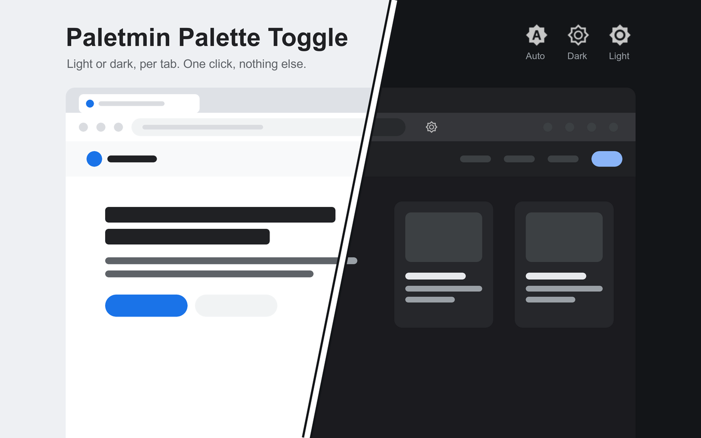

# Paletmin Palette Toggle

A Chrome extension that switches the current tab between a website's light and dark palettes.

Click the toolbar icon to cycle through three modes:

- **Auto**: the tab follows Chrome's light or dark mode.
- **Dark**: the tab sees `prefers-color-scheme: dark`.
- **Light**: the tab sees `prefers-color-scheme: light`.

The first click always selects a scheme different from Chrome's. When Chrome uses light mode, the order is Auto → Dark → Light → Auto. In dark mode, the order is Auto → Light → Dark → Auto. The icon shows the tab's mode and matches Chrome's toolbar.

A crossed-out A means the main page is restricted or no compatible palette was detected after observing a fresh page load. Pages that were already open keep the normal mode icon while support is uncertain. Hover over the icon for details. Detection looks for accessible color-scheme media queries, JavaScript queries made after the extension starts, and pages that declare both light and dark in `color-scheme`. You can still click an accessible page to try switching it. Detection updates as styles and scripts load.

The extension changes the color scheme a website thinks you prefer and rewrites the website's matching media queries. It does not add a theme of its own. If a website has no dark theme or ignores the system preference, nothing changes.

There is no popup, settings page, account, or data collection. See [PRIVACY.md](PRIVACY.md). The code is open source under the MIT license.

## Install

1. Open `chrome://extensions` and turn on **Developer mode**.
2. Click **Load unpacked** and select this folder.
3. Optional: assign a keyboard shortcut in `chrome://extensions/shortcuts`.
4. Optional: for local files, turn on **Allow access to file URLs** on the extension's details page.

Chrome warns that the extension can read and change data on all websites. This permission lets its scripts run in every tab. The extension collects no data and makes no network requests.

Existing tabs are initialized after installation and when the extension is re-enabled, so compatible CSS themes work without a reload. If a site's scripts saved their theme preference before the extension started, that page may need one reload. The tooltip explains this without marking the page as unsupported.

## How it works

When the selected scheme differs from Chrome's, the extension swaps `dark` and `light` in each accessible `prefers-color-scheme` query:

- `@media` and `@import` rules in stylesheets, including nested groups;
- `media` attributes on `<source>`, `<link>`, `<style>`, and `<meta>`;
- `matchMedia()` results and their `change` events, through a script that runs before the page's scripts.

Rules inside cross-origin stylesheets cannot be read from the page and remain unchanged. If a page declares `color-scheme: light dark` on its root or body, the extension forces that property too. This affects `light-dark()` colors and form controls.

Each tab keeps its mode for the browser session. The mode is applied to every frame and reapplied after navigation. Auto restores the original queries. A hidden, bundled extension document reads Chrome's native color scheme and watches for changes, so the toolbar icon initializes even when the current tab is a protected page. The last known scheme is also kept across restarts. Website preferences do not change the toolbar icon's color.

After an extension update or reload, the new page script tells the previous content script to restore the page and stop. The same happens in a frame whose initial `about:blank` document was replaced by a same-origin page, where Chrome keeps the old copy alive. The page-side controller remains active so existing `matchMedia()` results keep receiving correct values and `change` events.

## Limits

- `chrome://` pages, the Chrome Web Store, and pages without granted site access show a crossed-out A. Palette switching is unavailable there.
- A detected query is evidence of palette support, not a guarantee that the whole page will change. Undetected JavaScript, inaccessible stylesheets, and themes inside frames or shadow roots can limit detection. An embedded widget alone does not mark the main page as compatible.
- Custom Chrome themes can use toolbar colors that differ from the native color scheme available to extensions.
- Styles inside shadow roots are not rewritten.
- Rules inside stylesheets loaded from another origin are not rewritten. A `media` attribute on their `<link>` element is still handled.
- Scripts that call `matchMedia()` in the first milliseconds of a page load may see Chrome's scheme. They receive a `change` event once the mode is applied.

## Author

[Ilia Ross](https://github.com/iliaross).
